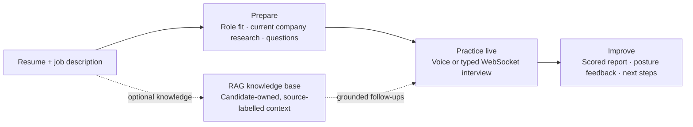

# HUSTLRZZ V2

### Your private, real-time AI mock interview coach

> Prepare from your own resume. Practice with a live AI interviewer. Improve what you say — and how you say it.

[**Launch the live app ↗**](https://frontend-deepaklearn7878-6255s-projects.vercel.app) &nbsp;·&nbsp;
[Backend health ↗](https://hustlrzzv2-production.up.railway.app/health) &nbsp;·&nbsp;
[Explore the code](https://github.com/dgexplores/hustlrzzv2)

---

## The problem

Interview preparation is usually fragmented: static question banks do not know
the candidate, generic tools cannot probe a real answer, and most feedback
ignores confidence, posture, and delivery.

**HUSTLRZZ V2 closes that gap.** It turns a resume and job description into a
focused practice plan, conducts a conversational mock interview, and gives the
candidate an actionable report — all in one private workspace.

## One product, end-to-end practice



| Step | Candidate experience | What HUSTLRZZ does |
| --- | --- | --- |
| **01 — Prepare** | Add a PDF/DOCX resume, company, and target job description | Finds role fit, researches current company signals with visible sources, and creates focused questions, model answers, and answer hints. |
| **02 — Practice** | Respond by typing or voice | Runs a live, follow-up capable AI interview over WebSocket. |
| **03 — Improve** | Review the session | Delivers a scored report, practical recommendations, and presentation signals. |

The Coaching Lab also includes a realistic **Practice Room**: rehearse behavioral,
leadership, introduction, or offer-negotiation scenarios by voice or keyboard while
camera-based gesture, gaze, and posture signals run privately in the browser. The
coach combines the editable transcript with directional presence metrics to return
separate content and delivery feedback, a stronger answer, and a focused next drill.

## What makes it different

### Context-aware interview preparation

Rather than serving a generic list of questions, the system starts from the
candidate's own resume and target role. It produces a responsive, focused pack
of 12 questions by default, with company-matching analysis and model answers.
When a target company is supplied, a separate evidence-first research step
searches the public web on demand—only when the preparation is run. It covers
official role requirements, hiring stages, candidate-reported question patterns,
evaluation criteria, company values, engineering/product signals, annual reports,
and recent news. The resulting interview blueprint records its retrieval time,
confidence, and clickable source IDs; unsupported citations are removed before
results reach the interface. Public reports are treated as likely patterns, never
as a guaranteed private hiring process.

### A real conversational mock interview

The interviewer works live over WebSocket. Candidates answer in text or with
browser speech input; the coach can respond, probe further, and build a final
coaching report from the session.

### Content *and* presence feedback

MediaPipe runs in the browser to estimate posture, eye contact, and gestures.
Camera frames are not uploaded by this application, keeping body-language
practice private and avoiding server-side video processing.

### Career coaching beyond the interview

HUSTLRZZ also includes job-description versus resume analysis, interview-style
company playbooks, saved practice history, and structured salary-negotiation
coaching. The coaching lab presents role-fit evidence, skill gaps, exact
negotiation wording, risky phrases to avoid, and decision guardrails.

## Designed for reliable AI practice

| Layer | Production approach |
| --- | --- |
| **Interface** | Next.js 15, TypeScript, Tailwind, accessible responsive UI with light, dark, and system themes |
| **Live service** | Python FastAPI and WebSockets |
| **AI resilience** | Groq primary provider with optional Gemini fallback |
| **Data & identity** | Supabase Auth + PostgreSQL with Row-Level Security |
| **Voice & camera** | Browser-native Web Speech and in-browser MediaPipe |
| **Deployment** | Vercel frontend + Railway API |

## Retrieval-Augmented Generation (RAG)

RAG is implemented as an optional, safe enhancement — it never blocks an
interview if embeddings or the knowledge database are unavailable.

1. Candidate-owned material (resume, portfolio notes, practice notes, or prior
   reports) is validated, chunked, embedded with Gemini, and stored in
   Supabase pgvector.
2. Every query is filtered by `user_id` at the API and database levels.
3. During a live interview, the three most relevant **source-labelled** chunks
   can ground a follow-up question or feedback without inventing experience.
4. Final reports can be indexed to make future practice sessions progressively
   more useful.

## Built-in safeguards

- Candidate data is protected by Supabase Row-Level Security.
- The service-role key stays backend-only.
- Camera analysis stays in the browser; the app does not upload video frames.
- Source-aware web research is time-bounded, ignores instructions found in source snippets, and falls back to a labelled built-in profile when unavailable.
- Timeouts and non-fatal RAG failures keep preparation and interviews responsive.
- `GET /health` reports API, AI-provider, and database readiness.

---

## For evaluators: demo flow

1. Open the [live application](https://frontend-deepaklearn7878-6255s-projects.vercel.app) and create an account.
2. In **Prepare**, add a short resume and a target job description.
3. Review the tailored question pack, then begin an interview.
4. Answer using text or microphone and enable the camera for local posture signals.
5. End the interview to view the scored coaching report and saved history.

## Project layout

```text
backend/         FastAPI: preparation, live interviewer, judge, coaching, RAG
frontend/        Next.js: auth, prepare, interview, coaching, dashboard
supabase/        schema, migrations, hosted Auth configuration
docs/            operations guidance, including future verified-email setup
Dockerfile       backend image for Railway or another Docker host
```

## Run it locally

### 1. Create Supabase resources

1. Create a project at [supabase.com](https://supabase.com).
2. For a fresh project, run `supabase/schema.sql` in the SQL editor. Existing
   installations can apply `supabase/migrations/20260809110000_rag_knowledge.sql`.
3. Copy the project URL, `anon` key, and `service_role` key from **Project Settings → API**.

### 2. Start the API

```bash
cd backend
uv venv .venv && source .venv/bin/activate
pip install -r requirements.txt
cp .env.example .env
# Configure GROQ_API_KEY (or GEMINI_API_KEY) and the Supabase server keys.
uvicorn backend.app:app --reload --port 8000
```

API documentation is available at <http://localhost:8000/docs>.

### 3. Start the web app

```bash
cd frontend
npm install
cp .env.local.example .env.local
# Set NEXT_PUBLIC_API_URL=http://localhost:8000 and Supabase public values.
npm run dev
```

Open <http://localhost:3000>, sign up, prepare a role, and start practicing.
The demo configuration creates a session immediately after email/password
signup. See [email setup](docs/EMAIL_SETUP.md) before enabling verified-email
delivery with Resend.

## Deployment checklist

- **Vercel:** set the project root to `frontend`; configure
  `NEXT_PUBLIC_SUPABASE_URL`, `NEXT_PUBLIC_SUPABASE_ANON_KEY`, and
  `NEXT_PUBLIC_API_URL` for Preview and Production.
- **Railway:** deploy the repository Dockerfile; configure provider and
  Supabase server keys; add permitted custom origins to `CORS_ORIGINS`.
  Set `ENABLE_WEB_SEARCH=true` for on-demand company intelligence (enabled by
  default in new deployments). `WEB_SEARCH_TIMEOUT_SECONDS=15` keeps broad web
  research bounded and lets preparation fall back safely when sources are slow.
- **Supabase:** apply the schema or RAG migration. Never expose
  `SUPABASE_SERVICE_ROLE_KEY` in frontend variables.
- **RAG:** configure `GEMINI_API_KEY` to enable embeddings; the app remains
  fully usable if candidate knowledge retrieval is unavailable.

## Key API routes

| Route | Purpose |
| --- | --- |
| `POST /workflows/start` | Resume + JD → tailored interview pack |
| `WS /ws/{session_id}` | Live interviewer and judge report |
| `GET /workflows`, `GET /interviews` | Candidate history |
| `POST /coaching/analyze` | JD-versus-resume analysis |
| `POST /coaching/salary` | Salary negotiation coaching |
| `POST /coaching/practice` | Typed/voice rehearsal → combined content and delivery coaching |
| `GET /knowledge/status`, `POST /knowledge/documents`, `POST /knowledge/search` | Candidate-owned RAG knowledge |

---

**HUSTLRZZ V2** brings role relevance, live practice, and private delivery
feedback together so candidates can enter interviews prepared to communicate —
not just to answer.
