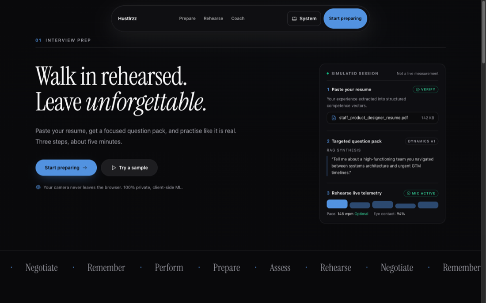
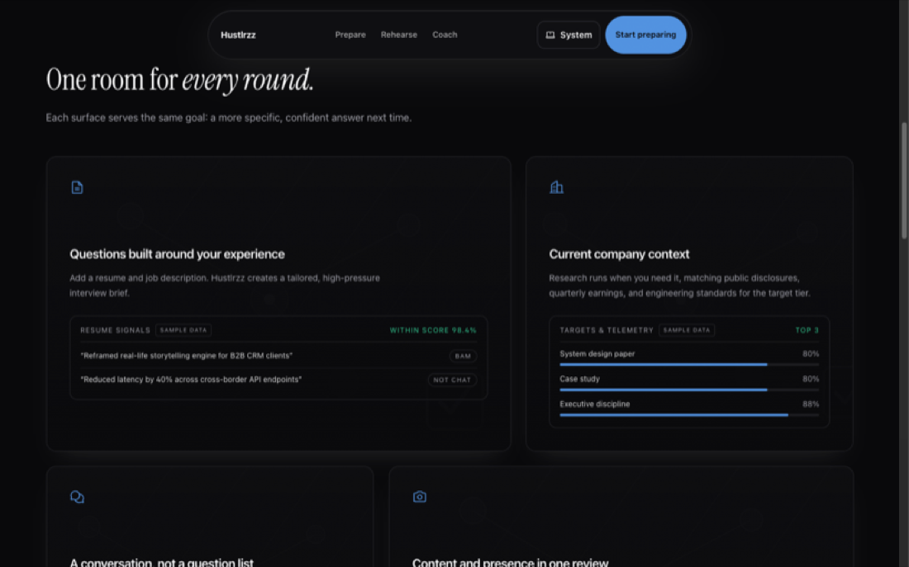
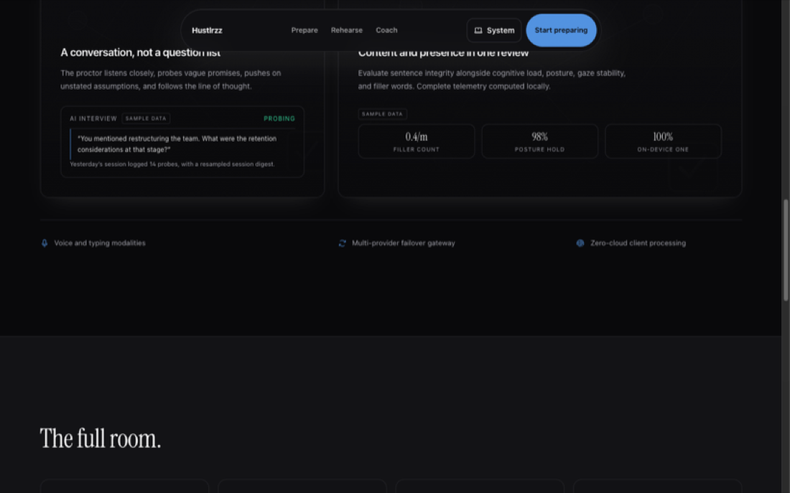
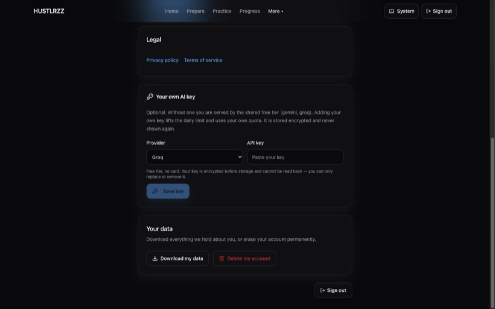
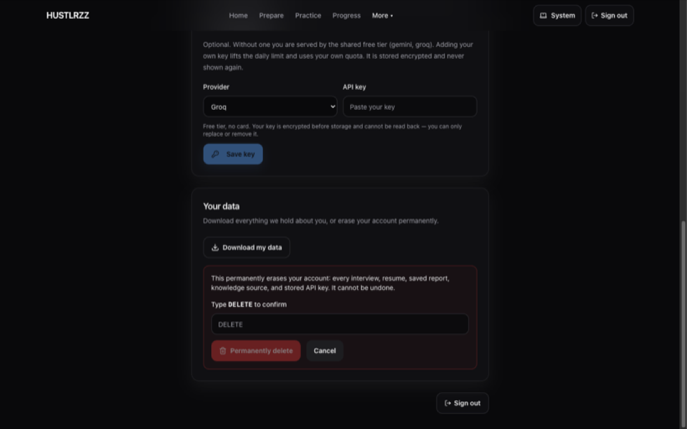
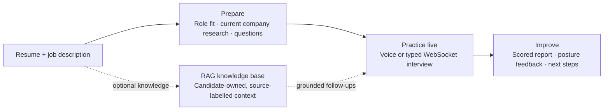

# Hustlrzz

[](https://github.com/dgexplores/hustlrzz/actions/workflows/ci.yml)

### Your private, real-time AI mock interview coach

> Prepare from your own resume. Practice with a live AI interviewer. Improve what you say — and how you say it.

<p align="center">
  <a href="https://hustlrzz.vercel.app">
    
  </a>
</p>

<p align="center">
  <a href="https://hustlrzz.vercel.app"><strong>Launch the live app ↗</strong></a>
  &nbsp;·&nbsp;
  <a href="https://hustlrzz-api.onrender.com/health">Backend health ↗</a>
  &nbsp;·&nbsp;
  <a href="https://github.com/dgexplores/hustlrzz">Explore the code</a>
  &nbsp;·&nbsp;
  <a href="docs/images_project/INDEX.md">Interface gallery</a>
</p>

<p align="center"><sub>
  Screenshots captured from the live deployment on 2026-09-28. Nothing here is a
  mock-up.
</sub></p>

## 60-second brief

Private AI mock-interview coach: resume + job description in, tailored question pack, live voice/typed WebSocket interview, scored report with presence feedback. Stack: Next.js 16 + TypeScript frontend, FastAPI interview service, Supabase Auth + Postgres (RLS), free-tier AI (Groq, Gemini) with per-user keys. Live app and backend health links above verified HTTP 200 on 2026-10-08.

| | |
|---|---|
| Code | [`backend/`](backend) — preparation, live interviewer, coaching, RAG · [`frontend/`](frontend) — auth, prepare, interview, dashboard |
| Data | [`supabase/`](supabase) — schema and migrations · [`docs/`](docs) — auth, email, ops guides |
| Specs | [`project-specs/`](project-specs) · [`project-docs/`](project-docs) (final-year submission pack) |

---

## Screenshots

<p align="center">
  
  
</p>

<p align="center"><sub>
  Every figure on the marketing page is illustrative. A visible <code>Sample data</code>
  badge sits inline with the label it qualifies, so <code>98.4%</code> and
  <code>Latency: 24ms</code> cannot be read as measurements taken on the visitor.
</sub></p>

<p align="center">
  
  
</p>

<p align="center"><sub>
  Left: a stored provider key is encrypted at rest and cannot be read back. Right:
  account deletion stays disabled until the exact word is typed, and the server
  enforces that check independently of the browser.
</sub></p>

---

## The problem

Interview preparation is usually fragmented: static question banks do not know
the candidate, generic tools cannot probe a real answer, and most feedback
ignores confidence, posture, and delivery.

**Hustlrzz closes that gap.** It turns a resume and job description into a
focused practice plan, conducts a conversational mock interview, and gives the
candidate an actionable report — all in one private workspace.

## One product, end-to-end practice


```mermaid
flowchart LR
    A["Resume + job description"] --> B["Prepare\nRole fit · current company research · questions"]
    B --> C["Practice live\nVoice or typed WebSocket interview"]
    C --> D["Improve\nScored report · posture feedback · next steps"]
    A -. optional knowledge .-> E["RAG knowledge base\nCandidate-owned, source-labelled context"]
    E -. grounded follow-ups .-> C
```

| Step | Candidate experience | What HUSTLRZZ does |
| --- | --- | --- |
| **01 — Prepare** | Add a PDF/DOCX resume, company, and target job description | Finds role fit, researches current company signals with visible sources, and creates focused questions, model answers, and answer hints. |
| **02 — Practice** | Respond by typing or voice | Runs a live, follow-up capable AI interview over WebSocket. |
| **03 — Improve** | Review the session | Delivers a scored report, practical recommendations, and presentation signals. |

The Coaching Lab also includes a consent-first, multi-turn **Practice Room**:
rehearse behavioral, leadership, introduction, or offer-negotiation conversations
against realistic follow-ups and objections by voice or keyboard. Camera-based
gesture, gaze, and posture signals run privately in the browser and permissions are
requested only after the user enters the studio. The final report combines the
approved transcript with session-normalized presence metrics, transcript-linked
feedback, a stronger answer, a focused next drill, and browser-local attempt history.

## What makes it different

### Context-aware interview preparation

Rather than serving a generic list of questions, the system starts from the
candidate's own resume and target role. It produces a responsive, focused pack
of 12 questions by default, with company-matching analysis and model answers.
When a target company is supplied, a separate evidence-first research step
searches the public web on demand—only when the preparation is run. It covers
official role requirements, hiring stages, candidate-reported question patterns,
evaluation criteria, company values, engineering/product signals, annual reports,
and recent news. The resulting interview blueprint records its retrieval time,
confidence, and clickable source IDs; unsupported citations are removed before
results reach the interface. Public reports are treated as likely patterns, never
as a guaranteed private hiring process.

### A real conversational mock interview

The interviewer works live over WebSocket. Candidates answer in text or with
browser speech input; the coach can respond, probe further, and build a final
coaching report from the session.

### Content *and* presence feedback

MediaPipe runs in the browser to estimate posture, eye contact, and gestures.
Camera frames are not uploaded by this application, keeping body-language
practice private and avoiding server-side video processing.

### Career coaching beyond the interview

HUSTLRZZ also includes job-description versus resume analysis, interview-style
company playbooks, saved practice history, and structured salary-negotiation
coaching. The coaching lab presents role-fit evidence, skill gaps, exact
negotiation wording, risky phrases to avoid, and decision guardrails.

## Designed for reliable AI practice

| Layer | Production approach |
| --- | --- |
| **Interface** | Next.js 16, TypeScript, Tailwind, accessible responsive UI with light, dark, and system themes |
| **Live service** | Python FastAPI and WebSockets |
| **AI resilience** | Free-tier providers only by default (Groq, then Gemini). Each provider is attempted once, then the request fails loudly rather than falling through into a paid provider. Paid providers are unreachable unless a user supplies a key or `AI_PROVIDER_ALLOW_PAID=1` |
| **Data & identity** | Supabase Auth + PostgreSQL with Row-Level Security |
| **Voice & camera** | Browser-native Web Speech and in-browser MediaPipe |
| **Deployment** | Vercel frontend + Render API (Docker, free tier) |

## Retrieval-Augmented Generation (RAG)

RAG is implemented as an optional, safe enhancement — it never blocks an
interview if embeddings or the knowledge database are unavailable.

1. Candidate-owned material (resume, portfolio notes, practice notes, or prior
   reports) is validated, chunked, embedded with Gemini, and stored in
   Supabase pgvector.
2. Every query is filtered by `user_id` at the API and database levels.
3. During a live interview, the three most relevant **source-labelled** chunks
   can ground a follow-up question or feedback without inventing experience.
4. Final reports can be indexed to make future practice sessions progressively
   more useful.

## Bring your own key (BYOK)

Interview preparation costs several LLM calls per run. On a shared free tier those
calls are rate-limited, so HUSTLRZZ lets a user attach their own provider key.

- A user's key is stored per provider in `user_ai_keys` as **AES-256-GCM**
  ciphertext. The provider name and the owning user id are bound in as additional
  authenticated data, so a ciphertext cannot be replayed under a different provider
  or a different user.
- The master key is `AI_KEYS_ENCRYPTION_KEY`. **There is deliberately no default.**
  When it is absent the keyring is disabled, the key routes return 503, and nothing
  is stored — a misconfigured deployment holds no keys rather than plaintext ones.
- The API never returns key material. Responses carry only the provider and the last
  four characters, and a middleware releases the decrypted value once the response
  has been produced.
- Without a user key, only providers with a usable free tier are reachable. A
  rate-limited free tier therefore cannot silently fall through into a paid
  provider — which is what previously turned a free-tier 429 into a bill.

**Limitation, stated plainly:** a server-side BYOK means this backend can decrypt
user keys while handling a request. That is inherent to proxying. Being structurally
unable to read them would require calling the provider from the browser, which is a
substantially larger change.

## Your data: export and deletion

GDPR and CCPA give users the right to take their data and to have it erased. Both
are implemented rather than handled by hand on request.

**Export** — `GET /account/export` returns every row this account holds across
thirteen tables as JSON, downloaded as a file. Stored provider keys are reported as
a hint rather than their ciphertext: the caller cannot decrypt the blob, and
shipping it in a JSON response would only expose ciphertext to anything
intercepting the download.

**Deletion** — `DELETE /account` clears thirteen user-scoped tables plus this user's
rate-limit keys, then removes the Supabase login. Three properties make it safe to
expose:

- **The login is deleted last, and only if every table succeeded.** If any table
  fails, the login survives so the caller can retry, rather than being locked out of
  data that is still there. The response names exactly what cleared and what did not.
- **Every table is attempted even after one fails**, so a partial erasure is
  reported rather than silently partial.
- **`company_intelligence` is never touched.** It is shared company research keyed
  by company, not by user; erasing it would destroy data belonging to every other
  account.

Both are rate limited (5 exports and 3 deletions per hour), the delete requires the
caller to type `DELETE`, and every erasure is written to the audit log as an id and
row counts only — never personal data.

**Backup caveat, stated plainly:** this erases rows from the live database. Rows
already captured in a database backup or a WAL snapshot are outside the reach of any
application-level delete, so "deleted" means "no longer in the live system".

## Built-in safeguards

- Candidate data is protected by Supabase Row-Level Security.
- The service-role key stays backend-only.
- Camera analysis stays in the browser; the app does not upload video frames.
- Source-aware web research is time-bounded, ignores instructions found in source snippets, and falls back to a labelled built-in profile when unavailable.
- Timeouts and non-fatal RAG failures keep preparation and interviews responsive.
- Paid AI providers are unreachable without a user key or an explicit operator opt-in.
- Stored user keys are encrypted at rest, are never returned by the API, and are bound
  to their provider and owning user.
- Stored user keys are never returned by any endpoint, including the account export.
- Account deletion is rate limited, requires explicit confirmation, deletes the login
  last, and reports per-table results.
- `GET /health` reports API, AI-provider, and database readiness.

---

## For evaluators: demo flow

> Hackathon submission pack (pitch, judging map, video script, checklist):
> [`docs/SUBMISSION_prometheus.md`](docs/SUBMISSION_prometheus.md).

1. Open the [live application](https://hustlrzz.vercel.app) and create an account.
2. In **Prepare**, add a short resume and a target job description (or Try sample).
3. Open any generated question's **Why it works** to learn the technique (Standard or Explain simply).
4. Review the tailored question pack, then begin an interview.
5. Answer using text or microphone and enable the camera for local posture signals.
6. End the interview to view the scored coaching report and saved history.
7. Revisit **Progress → Due practice** for spaced-repetition drills from your weak areas.

## Verification status

What has been proven against production, and what still needs a person. Kept here so
nobody has to guess which claims are load-bearing.

### Verified end-to-end against the live deployment

| Area | How it was verified | Result |
| --- | --- | --- |
| Google OAuth configuration | Asked Supabase to build the authorization URL for the exact `redirect_to` the frontend generates | Google provider enabled, real client ID issued, and `https://hustlrzz.vercel.app/auth/callback?next=/prepare` is allowlisted and passed through unchanged. A non-allowlisted origin is not honoured, which is the usual cause of a silent loop-back failure. |
| BYOK, full round trip | Created a throwaway account through the Supabase Auth API to obtain a real session, then exercised the live API | `PUT /ai/keys` returns a hint only, `GET /ai/keys` never returns the plaintext, `/ai/quota` flips to `own_key: true`, and `paid_allowed` stays `false` |
| Encryption at rest | Read the row straight out of Supabase and decrypted it with the live master key | Stored value is ciphertext with no plaintext, it decrypts correctly, and decryption under a different user id is refused |
| Free-only routing | Read `/ai/quota` with a live session | `byok_enabled: true`, `paid_allowed: false`, `shared_free_providers: [gemini, groq]` |
| Landing-page honesty | Grepped the served HTML | Sample-data markers present; the fabricated latency and version are gone |

The throwaway account, its stored key, and its database row were all removed
afterwards. The test key was a fake value, never a real credential.

### Not verified — requires a human

1. **The Google consent screen and token exchange.** Everything up to Google's
   authorization page is confirmed, and `/auth/callback` returns 200. Nobody has
   completed a real consent click, so the final code-for-tokens exchange is unproven.
2. **A real prepare run end to end in a browser.** Every API is verified
   individually; the full click-through has not been walked by a person.

### Manual checks

<details>
<summary>Two-minute verification anyone can run</summary>

**Google sign-in (the only untested link)**

1. Sign out, then open <https://hustlrzz.vercel.app>.
2. Click **Continue with Google** and complete consent.
3. Expect to land on `/prepare` signed in. The worst outcome is a bounce back to
   `/` with no error, which means the redirect is not allowlisted — see
   [docs/GOOGLE_AUTH_SETUP.md](docs/GOOGLE_AUTH_SETUP.md).

**Bring your own key**

1. Open **Settings**. The key form must not say "Not enabled on this deployment".
2. Add a key for one provider. Expect a hint ending in the last four characters.
3. Reload. The key must still be listed and the plaintext must not be anywhere.
4. **Remove the key afterwards** so you are not storing a real credential on a
   server that can decrypt it.

```bash
# Unauthenticated probe. 401 is the correct answer: auth is rejected before the
# keyring is consulted, so this cannot reveal whether BYOK is enabled.
curl -s -o /dev/null -w '%{http_code}
' https://hustlrzz-api.onrender.com/ai/keys
```

</details>

## Final year submission

The presentation deck, synopsis report, and in-depth project guide are kept
together in [`project-docs/final-year-submission/`](project-docs/final-year-submission/).
Each is available in both Office and PDF form, and the folder states the current
build status — roughly 40% functional — module by module.

## Project layout

```text
backend/         FastAPI: preparation, live interviewer, judge, coaching, RAG, AI providers
frontend/        Next.js: auth, prepare, interview, coaching, dashboard, settings
supabase/        schema, migrations, hosted Auth configuration
docs/            operations guidance, including Google auth and verified-email setup
project-docs/    evidence log, and the final-year submission pack (deck, report, guide)
project-specs/   product and technical specifications
project-tasks/   task breakdowns
Dockerfile       backend image for Render, Railway, or another Docker host
```

## Run it locally

### 1. Create Supabase resources

1. Create a project at [supabase.com](https://supabase.com).
2. For a fresh project, run `supabase/schema.sql` in the SQL editor. Existing
   installations should apply every file in `supabase/migrations/` in order;
   this includes Resume Analyzer, Phase 2 feedback, analytics, drills,
   interview intensity, and practice-feedback ownership.
3. Copy the project URL, `anon` key, and `service_role` key from **Project Settings → API**.

### 2. Start the API

```bash
cd backend
uv venv .venv && source .venv/bin/activate
pip install -r requirements.txt
cp .env.example .env
# Configure GROQ_API_KEY (or GEMINI_API_KEY) and the Supabase server keys.
uvicorn backend.app:app --reload --port 8000
```

API documentation is available at <http://localhost:8000/docs>.

### 3. Start the web app

```bash
cd frontend
npm install
cp .env.local.example .env.local
# Set NEXT_PUBLIC_API_URL=http://localhost:8000 and Supabase public values.
npm run dev
```

Open <http://localhost:3000>, sign up, prepare a role, and start practicing.
The demo configuration creates a session immediately after email/password
signup. See [email setup](docs/EMAIL_SETUP.md) before enabling verified-email
delivery with Resend.

## Deployment checklist

- **Supabase:** fresh installs use `supabase/schema.sql`; existing installs
  apply every migration in `supabase/migrations/` in order. The migration set
  includes Resume Analyzer, company intelligence + assessment rounds, workflow
  interview context, report feedback, privacy-safe analytics, spaced-repetition
  drills, interview intensity, practice-feedback ownership, and `user_ai_keys` for
  bring-your-own-key. Never expose `SUPABASE_SERVICE_ROLE_KEY` in frontend variables.
- **Vercel:** set the project root to `frontend`; configure
  `NEXT_PUBLIC_SUPABASE_URL`, `NEXT_PUBLIC_SUPABASE_ANON_KEY`, and
  `NEXT_PUBLIC_API_URL` for Preview and Production.
- **Render:** apply `render.yaml` (Docker, free tier, `/health` check); fill `GROQ_API_KEY`, `GEMINI_API_KEY`, `SUPABASE_URL`, `SUPABASE_SERVICE_ROLE_KEY` once in the dashboard; add permitted custom origins to `CORS_ORIGINS`.
  Set `ENABLE_WEB_SEARCH=true` for on-demand company intelligence (enabled by
  default in new deployments). `WEB_SEARCH_TIMEOUT_SECONDS=15` keeps broad web
  research bounded and lets preparation fall back safely when sources are slow.
  - **Bring your own key:** apply the `user_ai_keys` migration, then set
    `AI_KEYS_ENCRYPTION_KEY` to a 32-byte URL-safe base64 value. Generate one with
    `python3 -c "import base64,os;print(base64.urlsafe_b64encode(os.urandom(32)).decode())"`.
    **Store it somewhere durable** — it is the only thing that can decrypt stored
    user keys, and it cannot be recovered. With it unset, BYOK stays disabled and the
    key routes return 503. Both steps are optional; without them the shared free tier
    is used and nothing is stored.
  - `AI_PROVIDER_ALLOW_PAID=1` re-enables paid providers (OpenAI, OpenRouter) for
    **all** users. Unset by default. Prefer BYOK, which is per-user and metered
    against the user's own quota.
  - `AI_DAILY_RUN_CAP` bounds runs per user per UTC day and is `0` (off) by default.
    It is not applied to a caller using their own key, since that quota is theirs.
- **Google sign-in:** enable the Google provider and register the production
  callback URLs by following [the Google authentication setup](docs/GOOGLE_AUTH_SETUP.md).
- **RAG:** configure `GEMINI_API_KEY` to enable embeddings. The app remains
  fully usable if candidate knowledge retrieval is unavailable.
- **Error monitoring (optional):** set `SENTRY_DSN` on Render and
  `NEXT_PUBLIC_SENTRY_DSN` on Vercel to a [sentry.io](https://sentry.io) DSN.
  Both apps run fine without it. Leaving either unset disables reporting there.
- **Resume Analyzer:** apply the Resume Analyzer migration before deploying.
  It enforces a row-locked daily quota in Asia/Kolkata and stores structured
  results only; raw resume files and extracted text are not persisted.

## Key API routes

| Route | Purpose |
| --- | --- |
| `POST /workflows/start` | Resume + JD → tailored interview pack (+ auto-refreshed company intelligence fed into RAG) |
| `WS /ws/{session_id}` | Live human-voiced interviewer with follow-up probing and grounded judge report |
| `GET /workflows`, `GET /interviews` | Candidate history |
| `GET /companies/{name}/intelligence` | Auto-updating company hiring intelligence (rounds, patterns, difficulty) |
| `POST /assessment/start` | Timed multi-round screening battery (aptitude → technical → judgment) |
| `POST /assessment/attempts/{id}/submit` | Server-side graded round submission and final readiness report |
| `POST /coaching/analyze` | JD-versus-resume analysis |
| `POST /coaching/salary` | Salary negotiation coaching |
| `POST /coaching/practice` | Typed/voice rehearsal → combined content and delivery coaching |
| `POST /coaching/practice/turn` | Secure multi-turn coaching follow-up or objection |
| `POST /coaching/explain` | Learn mode: why a model answer works (standard or ELI5) |
| `GET /memory/drills` | Due spaced-repetition drills from your weak areas |
| `GET /knowledge/status`, `POST /knowledge/documents`, `POST /knowledge/search` | Candidate-owned RAG knowledge |
| `POST /resume-analyzer/analyze`, `GET /resume-analyzer/usage` | In-memory PDF/DOCX analysis with quota and history |
| `GET /ai/quota` | Shared free-tier quota, BYOK availability, and enabled providers |
| `GET /account/export` | Everything this account stores, as JSON, owner-scoped |
| `DELETE /account` | Irreversibly erase the account. Requires `{"confirm": "DELETE"}`; data first, login last |
| `GET /ai/keys` | List the caller's own provider keys (hints only, never key material) |
| `PUT /ai/keys` | Store or replace one key; takes `{"provider": "...", "api_key": "..."}` in the body |
| `DELETE /ai/keys/{provider_name}` | Remove one stored key |

---

**Hustlrzz** brings role relevance, live practice, and private delivery
feedback together so candidates can enter interviews prepared to communicate —
not just to answer.
