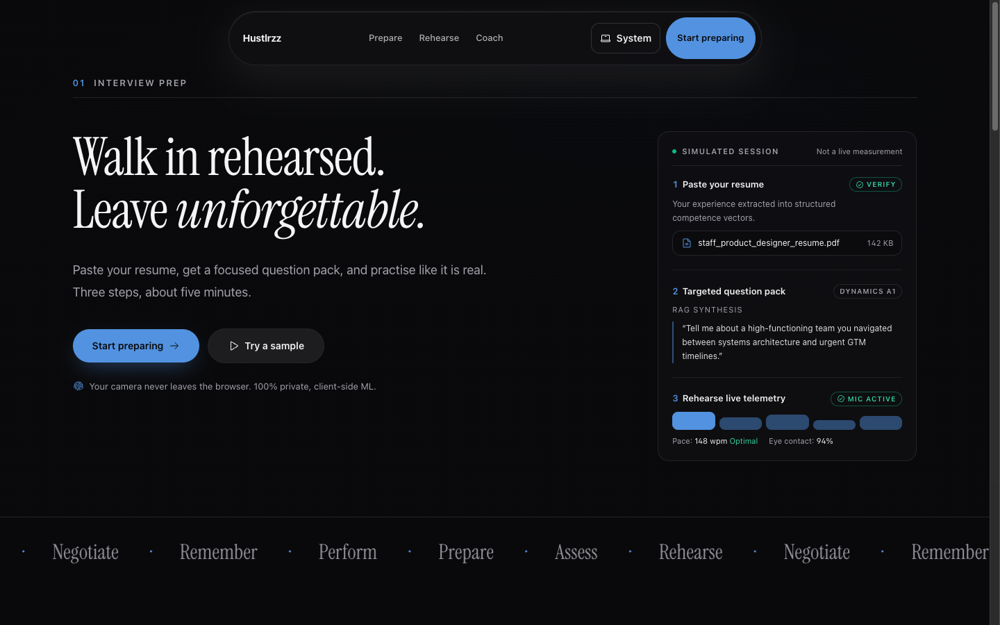
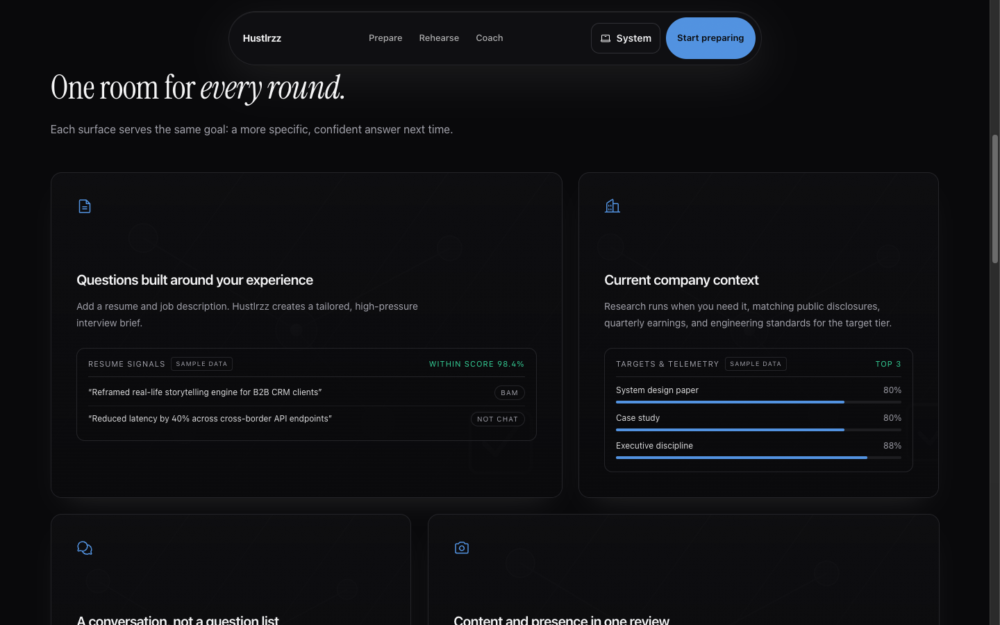
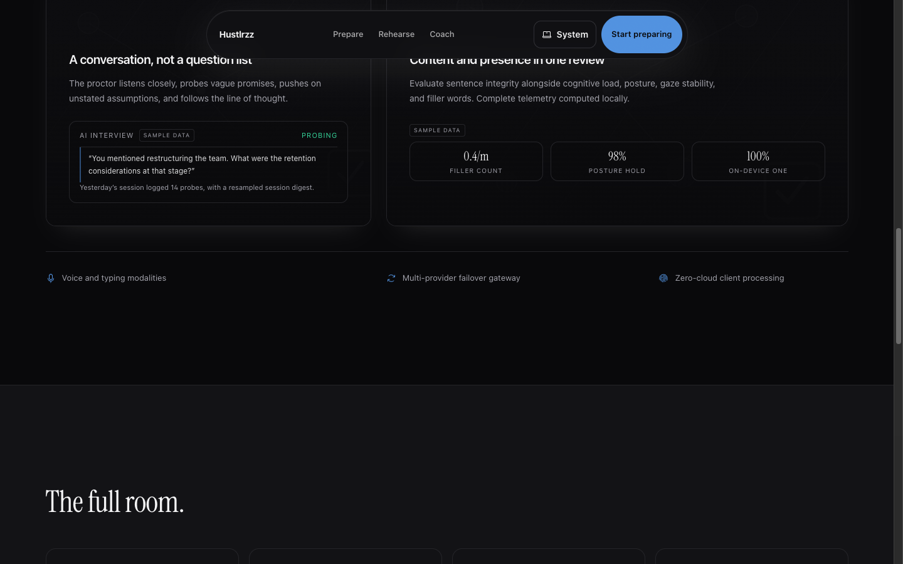
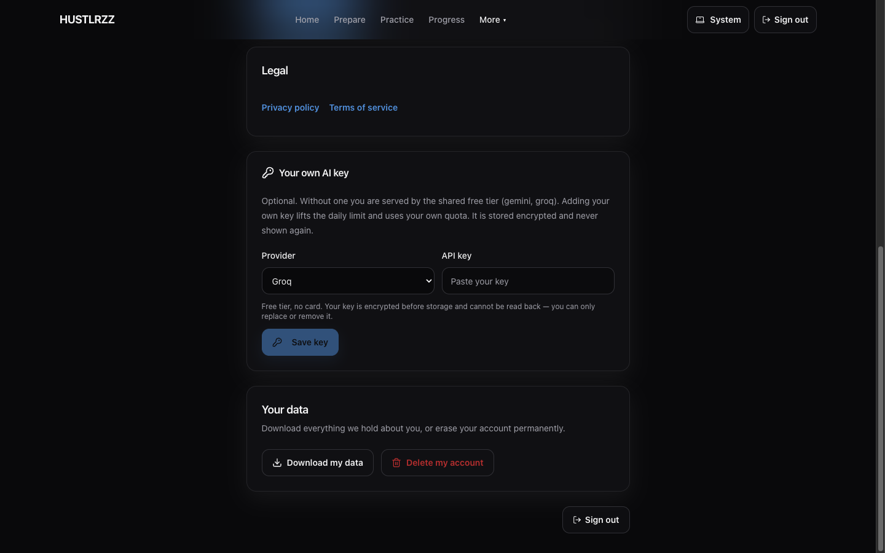
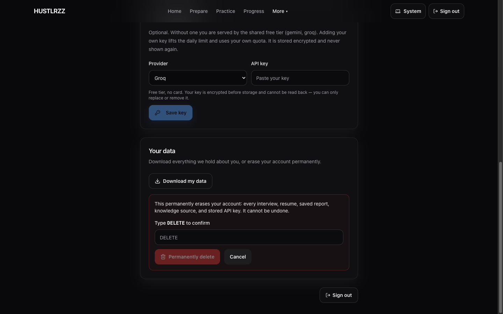

# Screenshots

Captured from the **live deployment** on 2026-09-28 at 1440×900, not from local
mock-ups. The two authenticated shots were taken by signing in through the real login
form with a throwaway account, which was deleted immediately afterwards. No personal
data and no real API key appear in any of them.

## 1. Landing hero



The hero panel is labelled **"Simulated session"** with **"Not a live measurement"**
where the telemetry would otherwise read as a measurement. The earlier copy claimed
`Simulated cockpit v2.4` and `Latency: 24ms` — a fabricated version and a fabricated
number.

## 2. Illustrative figures carry a visible marker



`98.4%` and the 80/80/88 bars read as results measured on the visitor unless
something says otherwise. Each panel now carries a `SAMPLE DATA` badge inline with
the label it qualifies.

## 3. …on every panel that shows a number



All four fabricated figures — `98.4%`, the telemetry bars, `14 probes`, and the
`0.4/m` · `98%` · `100%` tiles — are now marked. The claim under the tiles is
"Complete telemetry computed locally", which is true, so the numbers being labelled is
the only change needed.

## 4. Settings: bring your own key and data rights



Both features live. The key form shows the shared free tier (`gemini, groq`) and
states plainly that a stored key **cannot be read back**. This is the screenshot that
confirms `AI_KEYS_ENCRYPTION_KEY` reached production — when the keyring is disabled
this card renders "Not enabled on this deployment" instead.

## 5. The irreversible action is not one click away



`Permanently delete` is disabled until the exact word is typed. Case, a trailing
space, and a substring are all rejected, and the server enforces the same check
independently of the client.

## What these do not cover

- **Google sign-in completing a consent screen.** Untested — it needs a human at the
  consent step. Everything up to Google's authorization page is verified.
- **A real prepare run** generating questions. The endpoints are covered by tests; the
  full click-through has not been walked in a browser.

## Regenerating

```bash
# Landing page shots: scroll to the section first — the reveal animations keep
# content out of innerText until it scrolls into view, so a naive text check
# reports zero matches even when the badges are in the DOM.
# Authenticated shots: create a throwaway account, sign in through the form,
# screenshot, then delete the account.
```
