# Interface gallery

Every screen in Hustlrzz, captured from the **live deployment** on 2026-09-29 at
1440×900, then downscaled to 1100px wide.

These are not mock-ups. The authenticated shots were taken by signing in through the
real login form with a throwaway account, and the knowledge screens show a document
that was actually indexed and actually searched. The account and its data were
deleted afterwards.

## 01 · Sign in

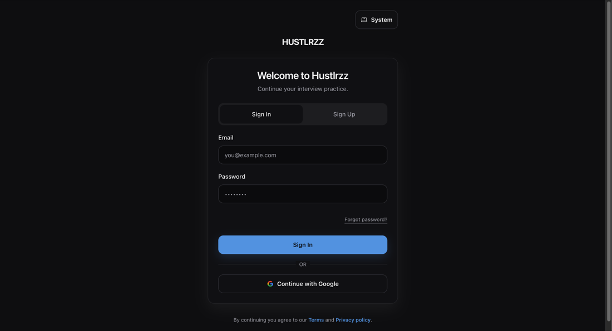

Email and password, or **Continue with Google**. The "Forgot password?" link is
present but non-functional — no mail provider is configured, so a reset email never
arrives. This is a known, accepted state for the prototype; see the evidence log.

## 02 · Prepare

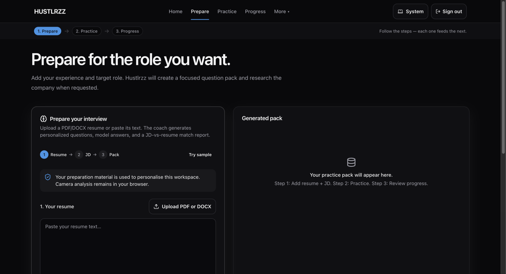

Step 1 of the journey. Resume by upload or paste, job description, optional target
company. Adding a company turns a 50-second pack into a 75-second one with live
company research.

## 03 · Knowledge base — empty

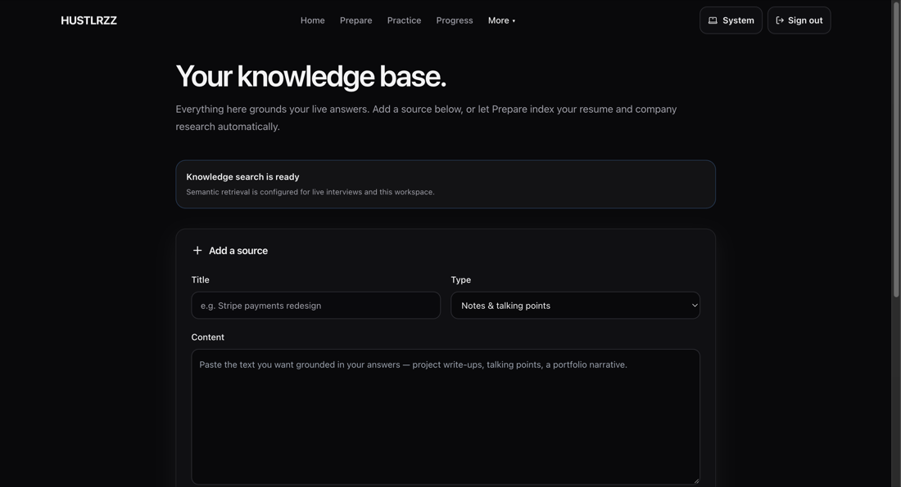

Before: this page existed but nothing on it worked. `POST /knowledge/documents` was
never called from the frontend, so Prepare was the only way to add a source — which
also made three of the five source types unreachable from any interface.

## 04 · Knowledge base — source added

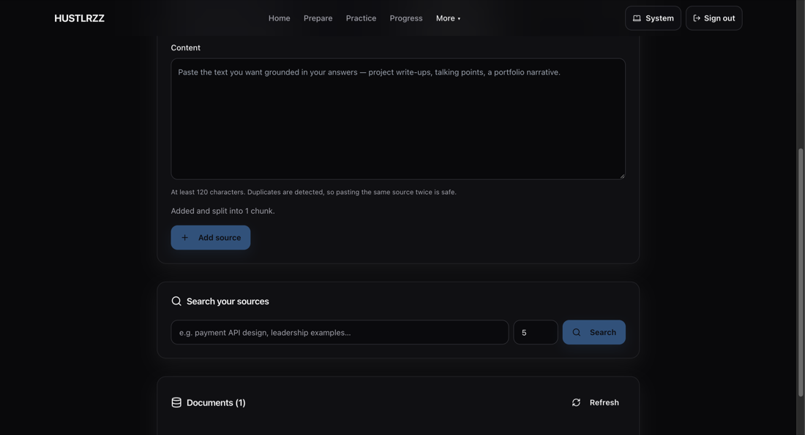

The same page after adding a source. The document list shows type, chunk count, and
the date. **This screen is why the embedding bug below was found** — the add failed
with "Knowledge indexing is temporarily unavailable" and no test had caught it.

## 05 · Knowledge base — semantic search

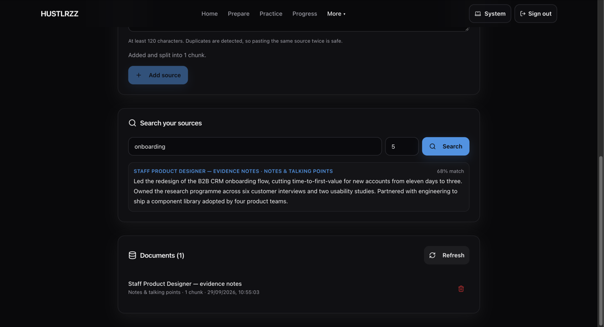

Searching `onboarding` returns the stored chunk with a **68% match**. The similarity
score was already being returned by the API and stored in component state; it was
never rendered. The result count is a control rather than a hardcoded `5`.

## 06 · Practice

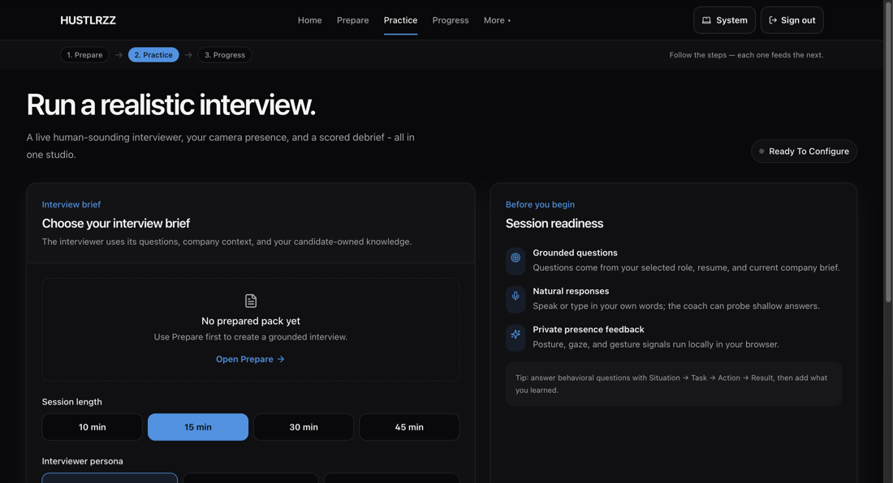

Session length, interviewer persona, and intensity. It correctly refuses to start
without a prepared pack, and points back to Prepare rather than failing.

## 07 · Coaching

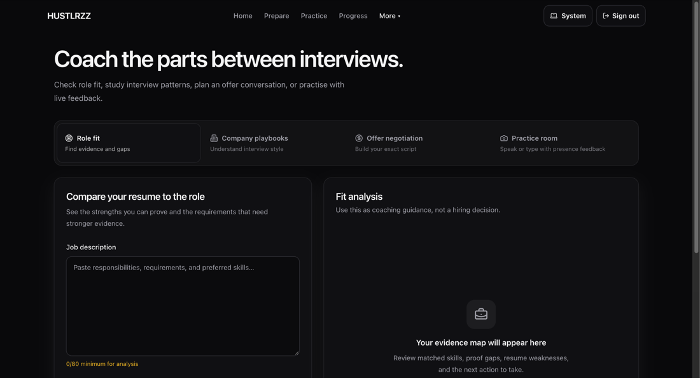

Four workspaces: role fit, company playbooks, offer negotiation, and the practice
room. Shown is role fit, with a character counter on both fields.

## 08 · Assessment

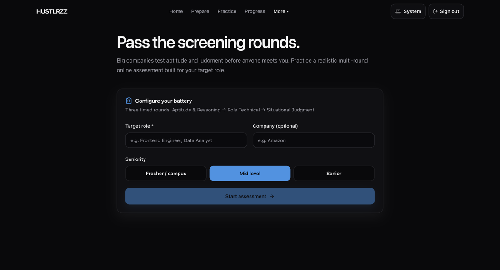

The timed multi-round screening battery.

## 09 · Progress

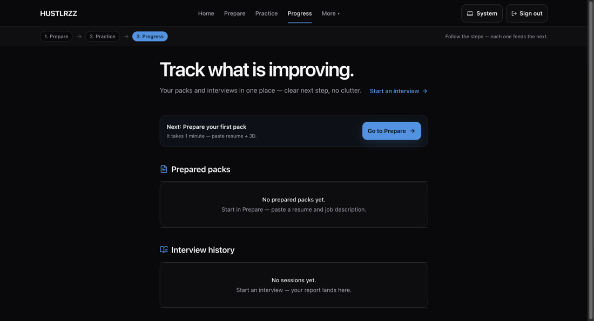

Packs and interview history, with honest empty states that name the next action
rather than showing a blank panel.

## 10 · Resume analyzer

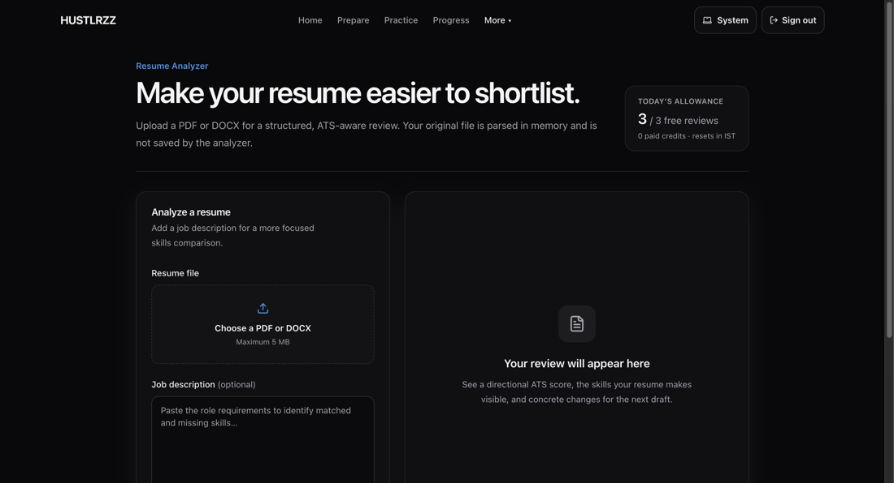

In-memory PDF/DOCX analysis behind a row-locked daily quota.

## 11 · Privacy

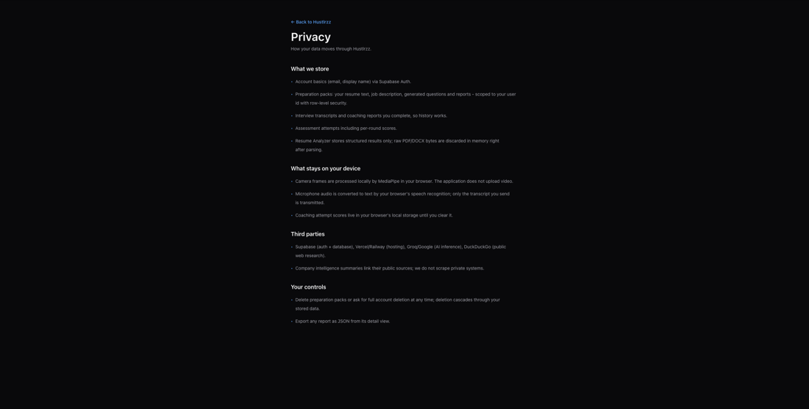

## 12 · Landing


The hero panel reads **"Simulated session"** with **"Not a live measurement"**. It
previously claimed `Simulated cockpit v2.4` and `Latency: 24ms` — a fabricated
version and a fabricated measurement.

---

## A real bug this gallery found

Screenshotting every screen surfaced a production fault no test covered.

**Every knowledge-base add failed.** The UI showed "Knowledge indexing is
temporarily unavailable" and the route returned 503.

`backend/config.py` defaulted `RAG_EMBEDDING_MODEL` to `models/text-embedding-004`.
That model no longer resolves for the configured Gemini key:

```
404  models/text-embedding-004 is not found for API version v1beta
```

The key can only reach `gemini-embedding-001`, `gemini-embedding-2-preview`, and
`gemini-embedding-2`. Since the page had shipped with no working add path and no
test exercised the real provider, the feature from the knowledge-completion work was
non-functional in production the whole time.

Fixed in three places so a fresh deploy cannot reintroduce it: the default in
`backend/config.py`, `backend/.env.example`, and `render.yaml`. The dimension was
already safe — `_embed` passes `output_dimensionality=768` and validates the returned
vector length, so `gemini-embedding-001` fits the existing `vector(768)` column
unchanged. No migration was needed.

## Not covered

- **Google sign-in completing a consent screen.** Needs a person; everything up to
  Google's authorization page is verified.
- **A finished interview with a scored report.** That needs a full live session.
- **`/dashboard/session/{id}`**, because this throwaway account had no session.

---

## Annotated shots

Captured in the same pass; kept here so the gallery stays the single image folder.

### 13 · Sample-data markers on illustrative figures


`98.4%` and the 80/80/88 bars read as results measured on the visitor unless something
says otherwise. Each panel carries a `SAMPLE DATA` badge inline with the label it
qualifies.

### 14 · …on every panel that shows a number


All four fabricated figures — `98.4%`, the telemetry bars, `14 probes`, and the
`0.4/m · 98% · 100%` tiles — are marked.

### 15 · Settings: bring your own key and data rights


A stored key is encrypted at rest and cannot be read back. This is the shot that
confirms `AI_KEYS_ENCRYPTION_KEY` reached production: a disabled keyring renders
"Not enabled on this deployment" instead.

### 16 · Account deletion is not one click away


`Permanently delete` stays disabled until the exact word is typed. Case, a trailing
space, and a substring are all rejected, and the server enforces the same check
independently of the browser.

## Note on the hero

`12-landing-hero.png` is the only landing capture. The earlier copy of it that lived in
a second folder was removed rather than kept, so the gallery holds one image per screen
and nothing is stored twice.
